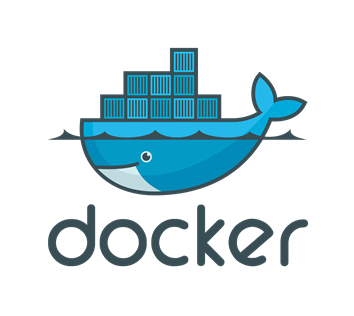

# 도커\(Docker\)란?

- 컨테이너를 싣고 다니는 고래!

 - 고래는 서버에서 여러 개의 컨테이너\(이미지\)를 실행하고 이미지 저장과 배포\(운반\)을 의미

 - 서비스 운영 환경을 묶어서 손쉽게 배포하고 실행하는 경량 컨테이너 기술

 - 도커 엔진\(Docker Engine\) 혹은 도커에 관련된 모든 프로젝트를 의미

 - 리눅스 컨테이너에 여러 기능을 추가함으로써 애플리케이션을 컨테이너로서 좀 더 쉽게 사용할 수 있게 만들어진 오픈소스 프로젝트

 - Go 언어로 작성되어 있다.

 - 도커 엔진은 컨테이너를 생성하고 관리하는 주체로서 이 자체로도 컨테이너를 제어할 수 있고 다양한 기능을 제공하는 도커의 주 프로젝트이다.

